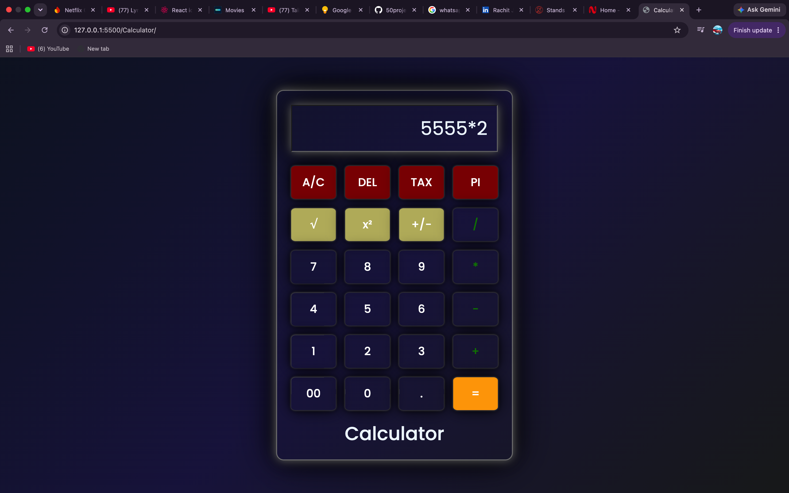

# Calculator

A responsive calculator built using HTML, CSS, and JavaScript.

## Features
- Basic arithmetic operations
- Percentage
- Delete
- Clear
- Responsive UI

## Technologies Used
- HTML5
- CSS3
- JavaScript

## Screenshot

## Live Demo

GitHub Pages link

## Author
Rachit Jain