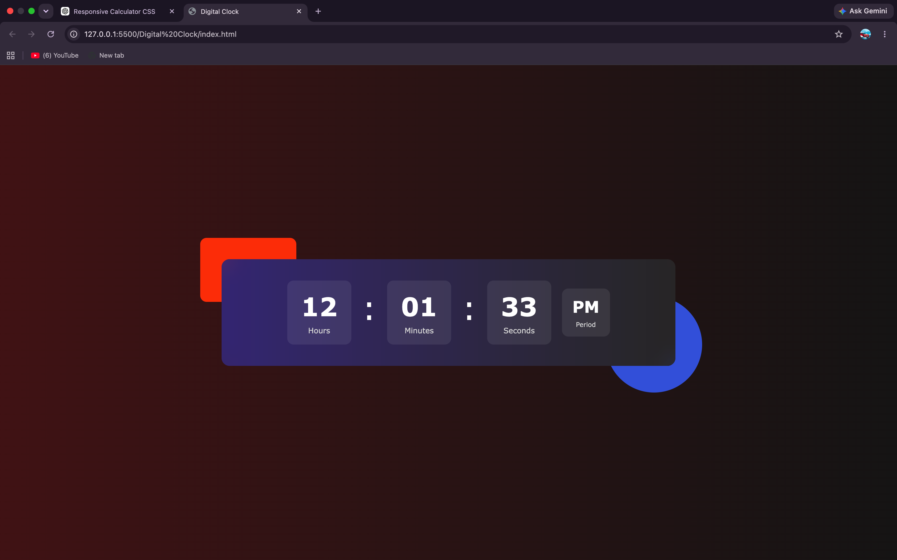

# 🕒 Digital Clock

A responsive digital clock built with **HTML5**, **CSS3**, and **JavaScript**. It displays the current time in 12-hour format with an AM/PM indicator.

## ✨ Features

- Live Time Display
- 12-Hour Format
- AM/PM Indicator
- Responsive Design
- Glassmorphism UI

## 🛠️ Technologies Used

- HTML5
- CSS3
- JavaScript (ES6)

## 📸 Preview

## 🚀 Live Demo

https://rachitjn29.github.io/Javascript-only-Projects/Digital%20Clock/

## 👨‍💻 Author

Rachit Jain