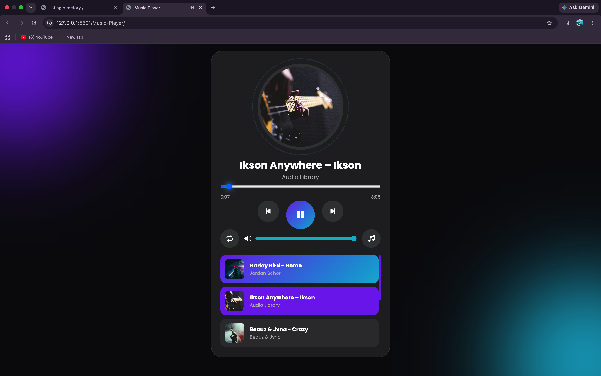

# 🎵 Music Player

A modern and responsive Music Player built using **HTML, CSS, and JavaScript**. It provides a clean glassmorphism UI with smooth animations and essential music playback controls.

## 🚀 Features

- ▶️ Play / Pause
- ⏮️ Previous Song
- ⏭️ Next Song
- 📜 Dropdown Playlist
- 🔁 Repeat Current Song
- 📊 Progress Bar with Seek
- ⏱️ Current Time & Duration
- 🔊 Volume Control
- 📱 Responsive Design

## 🛠️ Technologies Used

- HTML5
- CSS3
- JavaScript (Vanilla)
- Font Awesome

## 📂 Folder Structure

```
Music-Player/
│── images/
│── songs/
│── js/
│   ├── music-list.js
│   └── script.js
│── style.css
│── index.html
│── README.md
```


## 📸 Preview


## Live Demo

https://rachitjn29.github.io/Javascript-only-Projects/Music-Player/

## 👨‍💻 Author

**Rachit Jain**
