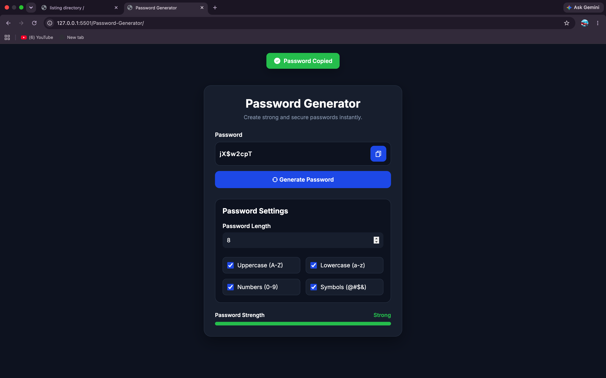

# 🔐 Password Generator

A simple and responsive Password Generator built using **HTML, CSS, and JavaScript**. It allows users to create strong, random passwords based on customizable options like uppercase letters, lowercase letters, numbers, symbols, and password length.

## 🚀 Features

- Generate secure random passwords
- Adjustable password length
- Include Uppercase Letters (A-Z)
- Include Lowercase Letters (a-z)
- Include Numbers (0-9)
- Include Symbols (!@#$%^&*)
- Password strength indicator
- One-click copy to clipboard
- Responsive design
- Clean and modern UI

## 🛠️ Built With

- HTML5
- CSS3
- JavaScript (ES6)

## 📸 Preview



## Live Demo

https://rachitjn29.github.io/Javascript-only-Projects/Password-Generator/

## 🎯 What I Learned

- DOM Manipulation
- Event Handling
- Random Password Generation
- Clipboard API
- Conditional Logic
- Responsive UI Design

## 📂 Project Structure

```
Password-Generator/
│── index.html
│── style.css
│── script.js
└── README.md
```

## 👨‍💻 Author

Rachit Jain