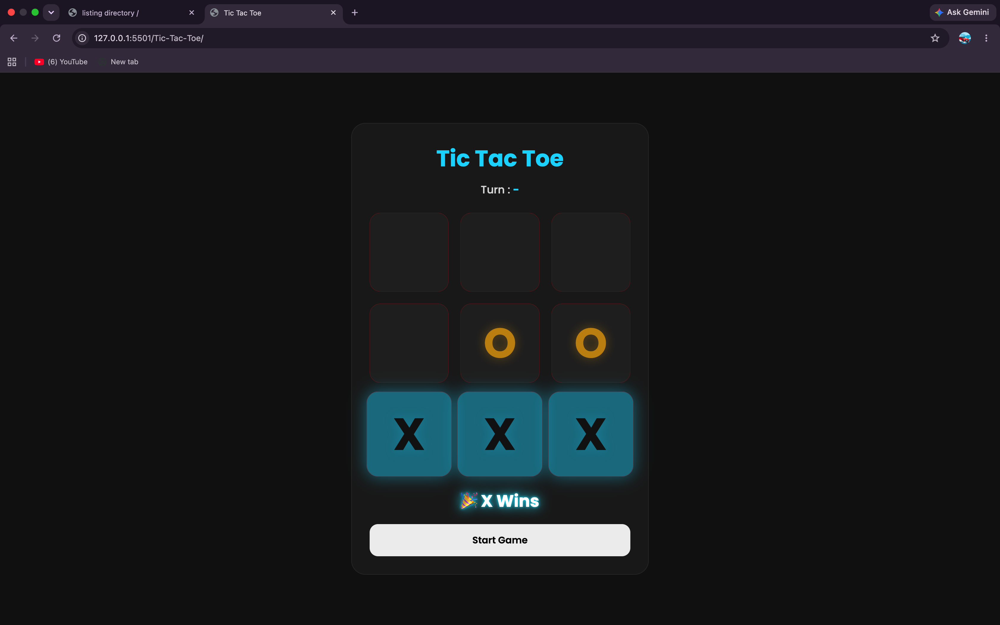

# 🎮 Tic Tac Toe

A modern and responsive Tic Tac Toe game built using **HTML, CSS, and JavaScript**. The game features a clean dark UI, animated neon winning line, turn indicator, and responsive design.

## 🚀 Features

- 🎯 Player vs Player
- ▶️ Start/Reset Game Button
- 🏆 Winner Detection
- 🤝 Draw Detection
- 🔁 Turn Indicator (X / O)
- 🚫 Prevents Playing on Filled Cells
- 🔒 Board Locks After Game Ends
- 📱 Fully Responsive Design
- 🎨 Modern Dark UI with Neon Effects
- ⚡ Smooth Animations

## 🛠️ Technologies Used

- HTML5
- CSS3
- JavaScript (ES6)

## 📸 Preview



## 🌐 Live Demo

https://rachitjn29.github.io/Javascript-only-Projects/Tic-Tac-Toe/

## 📂 Folder Structure

```
tic-tac-toe/
│── preview
│── index.html
│── style.css
│── script.js
│── README.md

```

## 👨‍💻 Author

**Rachit Jain**


